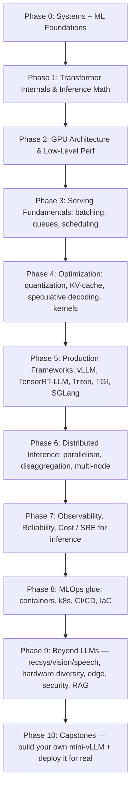

# Inference Engineering Mastery Roadmap
### From newbie → top 1% practitioner who can *build* production inference systems

> **Inference engineering** = the discipline of taking a trained model and serving it to real users: fast, cheap, reliable, at scale. It sits at the intersection of systems engineering (OS, networking, concurrency), computer architecture (GPUs, memory hierarchies), and ML (model internals). Training gets the headlines; **inference is >90% of the compute cost** of every AI product you've ever used (ChatGPT, Google Search's AI Overviews, Instagram's ranking, Netflix recommendations). This is the roadmap for mastering that 90%.

---

## 0. How to use this document

- **Do not skip phases.** Each phase assumes the previous one is muscle memory, not just "read about it."
- **Every phase has 4 parts**: Learn (plain-English + real sources) → Study real code (OSS) → Build (small + large project) → Internalize (best practices + self-check).
- **Ratio discipline**: for every 1 hour reading, spend 3 hours building/profiling/reading source code. Top 1% engineers are distinguished by *hours spent inside a profiler and inside someone else's source code*, not by papers read.
- **Every phase ends with a committed artifact** — a benchmark table, a profiler trace + writeup, or working code in this repo. Self-check questions are for you; artifacts are the proof. **No artifact = phase not finished.** This is also what you'll show in interviews.
- Track your work in [`projects/`](projects/README.md) (code) and [`labs/`](labs/README.md) (exercises). Best-practice checklists live in [`playbooks/`](playbooks/).
- New to this? Read [`GETTING-STARTED.md`](GETTING-STARTED.md) first — prerequisites and, critically, **how to get GPU access** (Phases 2, 4, 5, 6 need an NVIDIA GPU; an Apple Silicon Mac cannot run them).
- Unknown acronym? [`GLOSSARY.md`](GLOSSARY.md). Consolidated papers/blogs/repos/tools, plus the OSS-contribution and career layer: [`resources/README.md`](resources/README.md).
- Diagram of the whole track: [`assets/roadmap-diagram.md`](assets/roadmap-diagram.md).

---

## 1. The mental model

Two things run in parallel with every phase and never stop:
1. **Read one OSS codebase deeply per phase** (not skim — trace a real request end to end).
2. **Profile something real per phase** (nsight, py-spy, `torch.profiler`) — top 1% engineers *measure before they claim*.

---

## Phase 0 — Systems & ML Foundations
*Goal: stop being scared of C-level concepts and tensors. This phase is short if you already code comfortably in Python and know basic linear algebra.*

> **Detailed deep-dive (basics → advanced, plain words):** [`phases/phase-0/`](phases/phase-0/README.md) — 7 lessons that teach every bullet below from scratch, with runnable experiments.

### Learn (plain English)
- **How a computer actually runs your Python**: process vs thread, GIL, syscalls, memory (stack/heap), why Python is slow and C/CUDA are fast.
- **Concurrency vs parallelism**: async I/O (what FastAPI/uvicorn use) vs true parallel compute (what GPUs do). Inference servers live and die by this distinction — an inference server is I/O-bound while waiting for the network, but the model *forward pass* is compute-bound.
- **What "inference" actually is**: a trained model = fixed weight matrices. Inference = one forward pass (matrix multiplications + activations) to turn input tokens into output tokens. No backprop, no gradients — this is why inference workloads have a completely different performance profile than training.
- **Floating point basics**: FP32 vs FP16 vs BF16 vs INT8 vs INT4 — why precision reduction is the single highest-leverage inference optimization.

### Read
- Book: *Computer Systems: A Programmer's Perspective* (Bryant & O'Hallaron) — chapters on memory hierarchy, and machine-level code. You don't need to finish the whole book; get through Ch.1, 3 (intro), 6 (memory hierarchy), 9 (virtual memory).
- Book: *Designing Data-Intensive Applications* (Kleppmann) — Ch.1-2. Every inference server is a distributed system; this book is the grammar for the rest of your career.
- Blog: [Julia Evans — "How does networking work?"](https://jvns.ca/) style posts on syscalls/networking (her whole blog is gold for closing systems gaps).

### Build
- **Small project**: Write a Python HTTP server *without* any framework (raw `socket` module) that responds to `GET /health`. Then rewrite it with FastAPI. Compare — understand what the framework is doing for you.
- **Large project**: N/A yet — foundations phase has no large project by design.

### Self-check before moving on
- Can you explain why a GPU forward pass with batch size 1 wastes >90% of GPU compute? (If not: you don't yet understand compute vs memory-bound work — proceed to Phase 2 concepts early if needed.)

---

## Phase 1 — Transformer Internals & Inference Math
*Goal: know exactly what happens, tensor by tensor, when a model generates one token. Everything downstream (KV-cache, batching, quantization) is meaningless without this.*

> **Detailed deep-dive (basics → advanced, plain words):** [`phases/phase-1/`](phases/phase-1/README.md) — 10 lessons that build the transformer, the KV-cache, and the inference math from scratch.

### Learn (plain English)
- **Attention mechanism**: Query/Key/Value, softmax(QK^T/√d)V. Understand this as *"for each token, look back at every previous token and decide how much to weight it."*
- **Autoregressive decoding**: LLMs generate one token at a time, each new token depends on all previous ones → this is why LLM inference is fundamentally sequential and latency-sensitive, unlike a single-shot image classifier.
- **The KV-cache**: without caching, generating token N requires recomputing attention over all N-1 previous tokens from scratch — O(N²) total work. Caching keys/values from previous steps makes each step O(N) — but at the cost of **memory** that grows linearly with sequence length × batch size. This memory/compute trade-off is *the* central problem of LLM inference engineering.
- **Prefill vs decode**: "prefill" = processing the input prompt (compute-bound, parallel over all prompt tokens). "decode" = generating output tokens one at a time (memory-bandwidth-bound, sequential). Different bottlenecks → different optimization strategies. This distinction is the basis of modern disaggregated serving (Phase 6).

### Read
- Paper: *"Attention Is All You Need"* (Vaswani et al., 2017) — read it once, don't get stuck on it.
- Blog: [Jay Alammar — "The Illustrated Transformer"](https://jalammar.github.io/illustrated-transformer/) — best visual explanation that exists.
- Blog: [Lilian Weng — "Large Transformer Model Inference Optimization"](https://lilianweng.github.io/posts/2023-01-10-inference-optimization/) — this single post maps almost exactly onto Phases 3-4 of this roadmap. Read it now for orientation, re-read after Phase 4 and it will click completely differently.
- Code to read, not just papers: **Andrej Karpathy's [`nanoGPT`](https://github.com/karpathy/nanoGPT)** — the entire GPT architecture in ~300 lines. Read `model.py` top to bottom.

### Study this code
- `karpathy/nanoGPT` → `model.py`: find the `CausalSelfAttention` class, understand the causal mask.
- `huggingface/transformers` → pick any model (e.g. `models/llama/modeling_llama.py`) and find where `past_key_value` is passed and concatenated — that's the KV-cache, implemented plainly, no magic.

### Build
- **Small project**: Implement a minimal GPT-2-style forward pass **from scratch in NumPy** (no PyTorch) for a tiny hand-rolled model (or load real GPT-2 weights and reimplement just the math) — including manual KV-cache management as a Python dict of arrays. Generate text with it. This forces you to internalize every tensor shape.
- **Large project**: Build "GPT-2 inference from absolute scratch" — implement tokenizer decode, embedding lookup, attention, layernorm, feedforward, and greedy/top-k sampling, entirely without `transformers`/`torch.nn` (raw tensor ops only, PyTorch tensors allowed for math but no `nn.Module` layers). Benchmark it against the real HuggingFace GPT-2 pipeline for output-token match and speed. (This is essentially a personal version of [Karpathy's `llm.c`](https://github.com/karpathy/llm.c) philosophy — understand by rebuilding.)

### Self-check
- Can you draw, from memory, the exact tensor shapes flowing through one attention layer for batch=2, seq_len=10, heads=8, d_model=512?
- Can you explain why decode-phase inference is memory-bandwidth-bound (hint: for each generated token you read the *entire* model's weights from HBM to compute one token — arithmetic intensity is terrible)?

---

## Phase 2 — GPU Architecture & Low-Level Performance
*Goal: understand the hardware your model actually runs on. This is what separates people who "use vLLM" from people who can explain *why* vLLM is fast and could contribute to it.*

> **Detailed deep-dive (basics → advanced, plain words):** [`phases/phase-2/`](phases/phase-2/README.md) — 10 lessons taking you from "what is an SM" to plotting a measured roofline and writing a fused Triton kernel.

### Learn (plain English)
- **GPU vs CPU**: CPU = few powerful cores optimized for latency/branching. GPU = thousands of simple cores (organized into Streaming Multiprocessors, SMs) optimized for throughput on parallel, branch-free math — exactly what matrix multiplication is.
- **Memory hierarchy on a GPU**: HBM (large, slow, ~2-3 TB/s on H100) → L2 cache → SRAM/shared memory per SM (tiny, extremely fast, ~19 TB/s+). Almost every "kernel optimization" story (FlashAttention included) is really a story about **minimizing trips to HBM** and keeping data in SRAM.
- **The Roofline Model**: every computation is either *compute-bound* (limited by FLOPs) or *memory-bound* (limited by bytes moved). Compute **arithmetic intensity** = FLOPs / bytes moved. LLM decode is famously memory-bound: this single fact explains why batching, quantization, and KV-cache compression are the highest-leverage optimizations in the entire field.
- **CUDA basics**: kernels, threads/blocks/grids, warps (32 threads executing in lockstep), why warp divergence and uncoalesced memory access kill performance.

### Read
- Book: *Programming Massively Parallel Processors* (Kirk, Hwu, El Hajj) — the canonical CUDA book. Read Ch. 1-6 minimum.
- Blog: [Horace He — "Making Deep Learning Go Brrrr From First Principles"](https://horace.io/brrr_intro.html) — the best short explanation of compute-bound vs memory-bound vs overhead-bound that exists for ML engineers.
- Paper/blog: [Tri Dao — FlashAttention paper](https://arxiv.org/abs/2205.14135) + [FlashAttention-2 blog](https://tridao.me/blog/) — read *after* the roofline concept above; you should now understand it's an IO-aware algorithm, not a "faster math trick."
- NVIDIA blog: ["CUDA Refresher" series](https://developer.nvidia.com/blog/) and the [Nsight Compute docs](https://docs.nvidia.com/nsight-compute/).

### Study this code
- `Dao-AILab/flash-attention` — read the README's algorithm explanation, then look at the tiling logic in the CUDA kernel (even if you can't write CUDA yet, read the comments — they explain SRAM tiling directly).
- `pytorch/pytorch` → `aten/src/ATen/native/cuda/` — browse any simple kernel (e.g. elementwise ops) to see real CUDA kernel structure.

### Build
- **Small project**: Install NVIDIA Nsight Systems / Nsight Compute (or use Google Colab with GPU + `torch.profiler`). Profile a simple `torch.matmul` at different sizes and plot achieved TFLOPs vs matrix size — find where you hit the compute roofline. Then profile a memory-bound op (e.g. elementwise add on huge tensors) and show it's bandwidth-limited instead.
- **Large project**: Write your own **naive CUDA kernel** (or Triton kernel using OpenAI's `triton` language, which is much more approachable for a newbie) for a fused operation — e.g. a fused softmax or a fused bias+GELU — and benchmark it against the unfused PyTorch eager-mode version. Show the speedup and *explain it using the roofline model* (how many fewer HBM round trips).

### Tools to install and get comfortable with now
- `nvidia-smi`, **Nsight Systems**, **Nsight Compute**, `torch.profiler` + Chrome trace viewer, `triton` (pip install), `py-spy` (for Python-level CPU profiling of the serving process itself, not just the GPU kernel).

### Self-check
- Given a GPU's peak FLOPs and HBM bandwidth spec sheet, can you calculate the arithmetic intensity crossover point (the roofline "knee")?

---

## Phase 3 — Serving Fundamentals: Batching, Queueing, Scheduling
*Goal: this is where you become a "server engineer" for models, not just an ML person. This is the highest-leverage phase for interview-level and real-job skill.*

### Learn (plain English)
- **Static batching**: group N requests, run them together, wait for the slowest to finish (padding wastes compute on shorter sequences). Simple but bad tail latency.
- **Dynamic batching**: server waits a small time window to accumulate a batch before running it — trades a few ms of added latency for much higher throughput.
- **Continuous batching (a.k.a. in-flight batching)**: the breakthrough idea (from the Orca paper, popularized by vLLM) — instead of batching whole *requests*, batch at the *iteration* level. When one sequence in a batch finishes, immediately slot in a new request at the next decode step instead of waiting for the whole batch to drain. This is why vLLM/TGI got 10-20x throughput over naive HF `generate()` batching.
- **Queueing theory basics**: Little's Law (L = λW — concurrency = arrival rate × latency), why p99 latency explodes near saturation, head-of-line blocking.
- **Latency vs throughput tradeoff**, and why both single-number "average latency" and pure-throughput benchmarks are misleading — you must report **p50/p90/p99 latency at a given throughput / QPS**, exactly like MAANG SLOs do.

### Read
- Paper: *Orca: A Distributed Serving System for Transformer-Based Generative Models* (OSDI '22) — origin of continuous/iteration-level batching.
- Blog: [Anyscale — "How continuous batching enables 23x throughput in LLM inference while reducing p50 latency"](https://www.anyscale.com/blog/continuous-batching-llm-inference) — the clearest practitioner explanation of the above paper.
- Book: *Designing Data-Intensive Applications* Ch. 8 (Trouble with Distributed Systems) for the queueing/latency mental models.
- Blog: [Marc Brooker (AWS) on queueing and latency](https://brooker.co.za/blog/) — multiple posts specifically on why average latency lies and how AWS builders think about tail latency.

### Study this code
- `huggingface/text-generation-inference` (TGI) → look at the request queue and batching logic in the `router` (Rust) crate — even without deep Rust knowledge, the flow (`queue.rs`) is readable.
- `vllm-project/vllm` → `vllm/core/scheduler.py` — this *is* continuous batching, in Python, readable. Trace one request through `Scheduler.schedule()`.

### Build
- **Small project**: Take your Phase-1 from-scratch GPT-2 (or just use HF `pipeline`) and build a FastAPI server with **two endpoints**: `/generate_naive` (processes one request at a time, blocking) and `/generate_batched` (a background asyncio worker that accumulates requests for up to `T` ms or `N` requests, runs them as a real batch). Load test both with `locust` or a raw `asyncio` client and produce a table of p50/p90/p99 latency and throughput. Commit that table — it's your Phase 3 exit artifact, and the first "real" inference-engineering result you'll have produced.
- **Large project**: Extend the above into a **real continuous-batching engine**: maintain a pool of "in-flight" sequences, each with its own KV-cache, and at every decode step (a) advance every active sequence by one token, (b) evict finished sequences, (c) admit new queued requests into freed slots. Benchmark against your static/dynamic batching versions. This is literally a tiny vLLM scheduler.

### Best practices to internalize (see [`playbooks/benchmarking.md`](playbooks/benchmarking.md))
- Always benchmark at a *fixed load* (QPS), never "run N requests as fast as possible and take the average."
- Report percentiles, not means. Report time-to-first-token (TTFT) and time-per-output-token (TPOT) separately for streaming LLM APIs — these have different bottlenecks (TTFT ≈ prefill, TPOT ≈ decode).
- Warm up the server before measuring (JIT compilation, CUDA context init, cache warming all skew cold measurements).

### Self-check
- Can you explain, using Little's Law, why increasing max batch size beyond a certain point *increases* p99 latency even as throughput keeps rising?

---

## Phase 4 — Inference Optimization Techniques
*Goal: the actual toolbox of tricks MAANG/frontier labs use to make inference 10-100x cheaper. Each technique should be something you've implemented or at minimum benchmarked yourself, not just read about.*

### Learn (plain English)

1. **Quantization** — store/compute weights (and sometimes activations) in fewer bits (FP16→INT8→INT4). Reduces memory footprint and memory-bandwidth pressure (remember: decode is bandwidth-bound, so this directly speeds up decode). Key methods to know by name and idea:
   - **GPTQ** — post-training quantization using approximate second-order (Hessian) error correction, layer by layer.
   - **AWQ** (Activation-aware Weight Quantization) — protects the small % of "salient" weight channels that matter most, based on activation magnitude.
   - **bitsandbytes** LLM.int8() — mixed-precision decomposition to handle outlier features.
   - **KV-cache quantization** — quantizing the cache itself (not just weights), since at long context lengths the KV-cache can dwarf model weight memory.
2. **PagedAttention** — vLLM's core idea: manage the KV-cache like an OS manages virtual memory — in fixed-size, non-contiguous "pages," addressed via a block table, eliminating memory fragmentation from variable-length sequences. This is *the* single idea that made vLLM famous.
3. **Speculative decoding** — use a small/cheap "draft" model to propose several tokens ahead, then verify them all in one parallel forward pass with the big model, accepting the matching prefix. Turns sequential decode into (mostly) parallel verification. Variants to know: vanilla speculative decoding, Medusa (multiple decoding heads instead of a separate draft model), EAGLE.
4. **Flash Attention** (tie back to Phase 2) — IO-aware exact attention, standard in every serious serving stack now.
5. **Kernel fusion & compilation** — `torch.compile` (TorchInductor), CUDA graphs (capture a fixed sequence of kernel launches to eliminate Python/launch overhead — critical for small-batch, latency-bound decode), ONNX/TensorRT graph compilation.
6. **Structured/unstructured pruning & distillation** — smaller models (e.g., a distilled model serving 80% of traffic, falling back to a big model for hard cases) — the "model cascade" pattern used heavily in real ranking/search systems.

### Read
- Paper: *Efficient Memory Management for Large Language Model Serving with PagedAttention* (vLLM paper, SOSP '23).
- Paper: *GPTQ: Accurate Post-Training Quantization for Generative Pre-trained Transformers*.
- Paper: *AWQ: Activation-aware Weight Quantization for LLM Compression and Acceleration*.
- Paper: *Fast Inference from Transformers via Speculative Decoding* (Leviathan et al.) + blog: [PyTorch — "Accelerating Generative AI with PyTorch: Speculative Decoding"](https://pytorch.org/blog/).
- Blog: [HuggingFace — "A Gentle Introduction to 8-bit Matrix Multiplication"](https://huggingface.co/blog/hf-bitsandbytes-integration) and [HF quantization docs](https://huggingface.co/docs/transformers/quantization).
- Blog: [PyTorch — "CUDA Graphs"](https://pytorch.org/blog/accelerating-pytorch-with-cuda-graphs/) and `torch.compile` docs.

### Study this code
- `vllm-project/vllm` → `vllm/attention/backends/` and `vllm/core/block_manager.py` — see the actual page table implementation.
- `casper-hansen/AutoAWQ` and `IST-DASLab/gptq` — reference quantization implementations.
- `bitsandbytes` (`TimDettmers/bitsandbytes`) — read the `int8` matmul path.

### Build
- **Small project**: Take a HuggingFace model, quantize it with `bitsandbytes` (INT8) and with GPTQ/AWQ (via `auto-gptq`/`autoawq`), and benchmark: memory footprint, tokens/sec, and output-quality delta (perplexity on a small eval set) for FP16 vs INT8 vs INT4. Produce a table — this table alone is a strong portfolio artifact.
- **Large project**: Implement a **simplified PagedAttention** yourself — a Python KV-cache manager that allocates fixed-size blocks from a pool, maps logical sequence positions to physical blocks via a block table, and supports **prefix sharing** (two requests with the same system prompt share the same physical blocks, copy-on-write for divergence). Integrate it into your Phase-3 continuous-batching engine. This is the single most impressive project on this entire roadmap for demonstrating you understand "how vLLM actually works" rather than just "how to call vLLM."
- **Bonus large project**: Implement speculative decoding end-to-end with a small draft model (e.g. distilgpt2 drafting for gpt2-large) and measure the real speedup + acceptance rate.

### Self-check
- Explain PagedAttention's block table to someone in terms of OS virtual memory paging, in under 60 seconds.
- Why does quantizing to INT4 sometimes *not* speed up prefill much but *does* speed up decode a lot? (Ties back to compute-bound vs memory-bound from Phase 2.)

---

## Phase 5 — Production Serving Frameworks (read the masters' code)
*Goal: you should be able to deploy, configure, benchmark, and — critically — read/modify the source of every framework below. MAANG engineers rarely write inference engines from scratch; they extend and operate these.*

| Framework | Who built it / uses it | What to specifically study |
|---|---|---|
| **vLLM** | UC Berkeley (Sky Computing Lab); now industry standard, used by many labs & startups | `scheduler.py`, `block_manager.py`, continuous batching + PagedAttention interplay |
| **TensorRT-LLM** | NVIDIA | Graph compilation, in-flight batching implementation, custom fused kernels, quantization toolkit (SmoothQuant/AWQ integration) |
| **Triton Inference Server** | NVIDIA | Model repository config (`config.pbtxt`), dynamic batching config, multi-framework backend model, ensemble/pipeline models |
| **Text Generation Inference (TGI)** | HuggingFace, powers HF Inference Endpoints | Rust router + Python model server split; how they separate scheduling (fast, Rust) from computation (Python/CUDA) |
| **SGLang** | LMSYS org (same group behind Chatbot Arena) | RadixAttention (generalization of prefix caching using a radix tree), structured generation constraints |
| **Ray Serve** | Anyscale | Model composition/deployment graphs, autoscaling primitives, used heavily for multi-model pipelines in production (not just LLMs) |
| **DeepSpeed-Inference / DeepSpeed-MII** | Microsoft | Tensor-parallel inference kernels, ZeRO-inference for offloading |

### Read
- Each framework's own engineering blog: [vLLM blog](https://blog.vllm.ai/), [NVIDIA TensorRT-LLM blog posts](https://developer.nvidia.com/blog/tag/tensorrt-llm/), [HuggingFace TGI blog](https://huggingface.co/blog), [LMSYS blog on SGLang/RadixAttention](https://lmsys.org/blog/).
- Book: *Designing Machine Learning Systems* (Chip Huyen) — Ch. 7 (Model Deployment) and Ch. 10 (Infrastructure) map directly onto this phase; this is the best "how real companies structure ML infra" book available.

### Build
- **Small project**: Deploy the same model (e.g. Llama-3-8B or a smaller open model if GPU-constrained, e.g. Qwen2.5-1.5B) on **two different frameworks** (e.g. vLLM and TGI) locally or on a rented GPU (RunPod/Lambda/vast.ai), run the *identical* benchmark harness from Phase 3 against both, and produce a comparison report: throughput, TTFT, TPOT, memory usage, and ease of configuration.
- **Large project**: Stand up **Triton Inference Server** with an **ensemble pipeline**: a real multi-stage inference pipeline (e.g. audio → whisper transcription → LLM summarization → text-to-speech, or image preprocessing → classifier → postprocessing) as a single served ensemble with dynamic batching configured per stage. This mirrors real production pipelines (e.g. a content moderation pipeline: preprocessing → embedding model → classifier → policy layer) far more than a single-model demo does.

### Self-check
- Given a framework's GitHub issues page, can you find and understand a real bug report about batching/memory and explain the root cause from the source?

---

## Phase 6 — Distributed Inference at Scale
*Goal: single-GPU serving is the exception at frontier scale, not the rule. A 70B+ model doesn't fit on one GPU; a product with millions of users doesn't fit on one machine. This phase is "how OpenAI/Google/Meta/Anthropic actually run this."*

### Learn (plain English)
- **Tensor parallelism (TP)**: split individual weight matrices across GPUs (e.g. each GPU holds a slice of every attention head), requiring an all-reduce communication after each layer. Used *within* a node (fast NVLink/NVSwitch interconnect required).
- **Pipeline parallelism (PP)**: split the model's *layers* across GPUs/nodes (GPU 1 has layers 1-10, GPU 2 has layers 11-20...). Introduces "bubble" idle time; needs micro-batching to hide it.
- **Data parallelism** for inference: simplest — replicate the whole model on every GPU/node, load balance requests. This is what you scale first, before reaching for TP/PP.
- **Disaggregated prefill/decode**: a very recent (2023-2024) production pattern — run prefill (compute-bound, wants big batches, wants raw FLOPs) and decode (memory-bound, wants low latency, wants to preserve GPU memory for KV-cache) on *separate* GPU pools, transferring the KV-cache over the network between them (e.g. via NVLink or high-speed RDMA). This decouples two workloads with opposite hardware needs. (See DistServe, Splitwise, and Mooncake papers.)
- **Load balancing for stateful LLM serving**: unlike stateless HTTP services, if you use prefix caching, you want *sticky* routing (same conversation → same replica) to reuse cache — this breaks naive round-robin load balancers.
- **Autoscaling for GPU workloads**: GPU cold-start (model loading) can take minutes, unlike a stateless web service — this requires very different autoscaling strategies (pre-warmed pools, predictive scaling) than typical HPA/K8s autoscaling.

### Read
- Paper: *Megatron-LM: Training Multi-Billion Parameter Language Models Using Model Parallelism* (the TP/PP bible, techniques carry directly to inference).
- Paper: *DistServe: Disaggregating Prefill and Decoding for Goodput-optimized LLM Serving* and *Splitwise* (Microsoft) — both on prefill/decode disaggregation.
- Paper/blog: *Mooncake* (Moonshot AI) — KV-cache-centric disaggregated architecture, real production system description.
- Blog: [Google Cloud / GKE blog on autoscaling GPU inference workloads](https://cloud.google.com/blog/products/containers-kubernetes) and [AWS blog on EKS/Karpenter GPU autoscaling](https://aws.amazon.com/blogs/containers/) — search for "GPU autoscaling Kubernetes."
- Blog: any public engineering post from OpenAI/Anthropic/Meta about serving infra scale (these are sparse/high-level but read them for the "shape" of the problem — e.g. Meta's blog on serving Llama at scale, Character.AI's engineering blog on inference cost optimization).

### Study this code
- `NVIDIA/Megatron-LM` — read the tensor-parallel linear layer implementation (`ColumnParallelLinear`/`RowParallelLinear`) to see how a matmul is literally split across GPUs with `all_reduce`.
- `vllm-project/vllm` → distributed executor code (`vllm/executor/`, `vllm/distributed/`) — see TP implemented on top of PyTorch's distributed primitives.
- `ray-project/ray` → Ray Serve autoscaling policy code.

### Build
- **Small project**: Using PyTorch's `torch.distributed`, manually shard a simple feedforward or attention layer's weight matrix across 2 (simulated, can be 2 processes on CPU/1 GPU with `NCCL`/`gloo`) ranks, run a forward pass, and verify the output matches the non-sharded version. This demystifies TP completely.
- **Large project**: Deploy a model too large for one GPU (or artificially constrain a smaller model to simulate this) across multiple GPUs/processes using vLLM's built-in tensor-parallel serving (`--tensor-parallel-size`), then build a small **load balancer** (even a simple Python/NGINX reverse proxy) in front of multiple replicas implementing **prefix-aware sticky routing** (hash the first N tokens of the prompt/conversation ID to a consistent replica). Load test and show the cache-hit-rate difference vs round-robin.

### Self-check
- Given a model size, GPU memory, and number of GPUs, can you calculate whether you need TP, and how many GPUs minimum?
- Explain why prefill/decode disaggregation improves "goodput" (throughput that meets an SLO) even if it doesn't improve raw throughput.

---

## Phase 7 — Observability, Reliability, and Cost (SRE for inference)
*Goal: production inference systems are judged on SLOs, cost-per-token, and incident response — not benchmark numbers in isolation. This is the "boring" phase that actually gets you hired/promoted at MAANG.*

### Learn (plain English)
- **The four golden signals** (Google SRE): latency, traffic, errors, saturation — applied to inference: TTFT/TPOT latency, QPS/tokens-per-sec traffic, error rate (OOMs, timeouts, malformed generations), GPU utilization/KV-cache occupancy as saturation.
- **SLOs and error budgets**: define e.g. "p99 TTFT < 500ms" and treat exceeding your error budget as an incident, exactly like any other production service.
- **Canary deployments & shadow traffic** for model updates — never flip 100% of traffic to a new model/quantization config at once; MAANG companies mirror a % of live traffic to a new version and compare quality + latency before full rollout.
- **Cost accounting**: cost-per-1M-tokens as the fundamental unit economics metric; GPU-hour amortization, spot/preemptible instance strategy, batching's direct $ impact (2x throughput ≈ roughly 2x lower cost per token on the same hardware).
- **Chaos/failure testing**: what happens when a GPU OOMs mid-batch? When a node dies during a multi-node TP job? Good systems degrade gracefully (e.g. evict and retry a request) instead of taking down the whole replica.

### Read
- Book: *Site Reliability Engineering* (Google, free online) — Ch. 4 (SLOs), Ch. 6 (Monitoring Distributed Systems).
- Book: *Systems Performance* (Brendan Gregg) — for the general methodology of "USE method" (Utilization, Saturation, Errors) applied to any resource, GPUs included.
- Blog: search engineering blogs of **Character.AI**, **Together AI**, **Baseten**, **Modal**, **Fireworks AI** — smaller/mid-size companies whose entire business is inference cost efficiency, so their blogs are unusually detailed and practical (e.g. Character.AI's post on serving cost reduction via int8 + custom kernels).
- Blog: [Grafana Labs blog on GPU/ML observability](https://grafana.com/blog/) and [Prometheus docs on histograms](https://prometheus.io/docs/practices/histograms/) (you need histograms, not averages, for latency metrics — ties to Phase 3).

### Study this code
- `vllm-project/vllm` → `vllm/entrypoints/openai/` — see the actual Prometheus metrics they expose (`vllm:time_to_first_token_seconds`, `vllm:num_requests_running`, etc.) — this is a direct answer key for "what should I even measure."
- `DCGM` (NVIDIA Data Center GPU Manager) exporter for Prometheus — the standard way GPU metrics (utilization, memory, ECC errors, power) get scraped in every real GPU fleet.

### Build
- **Small project**: Instrument your Phase-3 server with `prometheus_client`: expose request latency histograms (p50/p90/p99 derivable), queue depth, batch size distribution, GPU memory usage. Wire up a local Grafana dashboard (Docker Compose: Prometheus + Grafana + your app) visualizing them live while you load-test.
- **Large project**: Build a small **canary/shadow deployment harness**: run two versions of your server (e.g. FP16 vs INT8 quantized) behind a proxy that mirrors a % of real traffic to the canary, logs both outputs, and computes an automated quality-diff report (e.g. embedding similarity or exact-match rate between canary and baseline outputs) plus a latency/cost comparison — the exact workflow used before shipping a quantized model to production.

### Self-check
- Can you define an SLO for a hypothetical chat product and design the specific Prometheus alert rules that would page someone when it's at risk?

---

## Phase 8 — MLOps Glue: Containers, Orchestration, CI/CD, IaC
*Goal: none of the above matters if you can't reliably ship it. This is the "unsexy 20%" that's actually required daily on the job.*

### Learn (plain English)
- **Docker for GPU workloads**: `nvidia-container-toolkit`, CUDA base images, multi-stage builds to keep images small, why `pip install torch` in a naive Dockerfile bloats images by gigabytes.
- **Kubernetes basics for GPU scheduling**: node selectors/taints for GPU nodes, resource requests (`nvidia.com/gpu: 1`), Helm charts for deploying model servers.
- **CI/CD for models**: what's different from normal software CI — you're testing model *outputs* (quality regressions) not just code correctness; artifact registries for model weights (not just Docker images); the need for a "model registry" (e.g. MLflow, or just a versioned S3/GCS bucket with metadata).
- **Infrastructure as Code**: Terraform basics for provisioning GPU instances/clusters reproducibly instead of clicking around a cloud console.

### Read
- Book: *Designing Machine Learning Systems* (Chip Huyen) — Ch. 9-10 (again — it's the single best MLOps-for-ML-systems book).
- HashiCorp Terraform docs (official, practical, don't need a book).
- Kubernetes docs: ["Schedule GPUs"](https://kubernetes.io/docs/tasks/manage-gpus/scheduling-gpus/) official page.

### Build
- **Small project**: Containerize your Phase-3/7 server properly: multi-stage Dockerfile, non-root user, health checks, `.dockerignore`, GPU-enabled base image, image size optimized.
- **Large project**: Write a minimal Terraform config that provisions a GPU instance (e.g. AWS `g5`/`g4dn` or a cheaper cloud like Lambda Labs/RunPod's Terraform provider if available) + a GitHub Actions CI/CD pipeline that: on push, builds the Docker image, runs your Phase-3 benchmark as a regression gate (fail the build if p99 latency or throughput regresses beyond a threshold), and deploys on success. This "benchmark-as-CI-gate" pattern is exactly what serious inference teams do.

---
## Phase 9 — Beyond LLMs: Recsys/Vision/Speech, Hardware Diversity, Edge, and Security
*Goal: "inference engineering" is bigger than LLM serving. This phase closes that gap — most of this roadmap goes deep on LLMs because that's where current MAANG hiring/blog output concentrates, but a top-1% inference engineer also knows why a recommender system serving 1M QPS at 10ms and an LLM serving 10 QPS at 2s are completely different engineering problems, and can serve on hardware other than an NVIDIA GPU.*

### Learn (plain English)
- **Recommendation/ranking inference**: the opposite extreme from LLMs — millions of QPS, sub-20ms latency budgets, tiny per-request FLOPs, but embedding tables that are **terabytes** in size (one per user/item feature). The bottleneck is usually feature-store/embedding-lookup network latency, not compute. Real systems: Meta's DLRM, Instagram/Facebook ranking, YouTube recommendations, Uber's Michelangelo platform.
- **Vision model serving**: throughput-oriented batch processing of images/video frames; the bottleneck is frequently **preprocessing** (JPEG decode, resize) on CPU, not the model forward pass — solved with GPU-accelerated decode (NVDEC/DALI) rather than a "faster model."
- **Speech (ASR/TTS) serving**: unlike offline vision/recsys, these are often **streaming** — you must emit partial output before the input finishes arriving, which requires chunked/incremental processing, a different latency contract than "wait for full input, then respond."
- **Hardware diversity**: NVIDIA GPUs aren't the only option. **TPUs** (Google, systolic-array architecture, compiled via XLA) power most of Google's own inference. **AWS Inferentia/Trainium** (Neuron SDK) are AWS's cost-optimized inference silicon. **CPU-only inference** is a legitimate production choice for smaller/quantized models (`llama.cpp` + GGUF format, ONNX Runtime with graph optimizations) — often cheaper than GPU for low-QPS or edge workloads. Choosing hardware is a cost/latency optimization problem, not a default.
- **Edge/mobile inference**: model must fit in megabytes not gigabytes, run on limited power/thermal budget, and often work fully offline. Apple's **Core ML**, Google's **TFLite**, and **ONNX Runtime Mobile** / Meta's **ExecuTorch** are the standard runtimes — real examples: on-device keyboard prediction, camera filters, Face ID.
- **Security & multi-tenancy in serving**: **prompt injection** (untrusted user/document input hijacking model behavior — the LLM-era equivalent of SQL injection), PII leakage into logs/outputs, **rate limiting/abuse prevention** (token-bucket per API key), and **GPU multi-tenancy isolation** (NVIDIA MIG partitions a physical GPU into isolated instances; time-slicing shares a GPU across tenants with weaker isolation) — the "noisy neighbor" problem is as real for GPUs as it is for any shared infrastructure.
- **RAG/agentic serving patterns**: retrieval (vector DB ANN search — HNSW, IVF indexes) adds a latency line item *before* the LLM call even starts; multi-step tool-calling/agent loops multiply end-to-end latency by the number of round trips. Budgeting and timing out each stage independently (not just the overall request) is what separates a working RAG demo from a production RAG service.

### Read
- Paper: *Deep Learning Recommendation Model for Personalization and Recommendation Systems* (DLRM, Meta/Facebook).
- Blog: [Uber Engineering — "Michelangelo: Machine Learning Platform"](https://www.uber.com/blog/michelangelo-machine-learning-platform/) and the Netflix Tech Blog's posts on their recommendation/inference stack.
- Blog: [Google Cloud blog on TPU inference and XLA compilation](https://cloud.google.com/blog/products/ai-machine-learning) and [AWS blog on Inferentia/Trainium + the Neuron SDK](https://aws.amazon.com/blogs/machine-learning/).
- `ggerganov/llama.cpp` README — the GGUF quantized format and why CPU-only inference is viable for smaller models.
- OWASP: ["Top 10 for Large Language Model Applications"](https://owasp.org/www-project-top-10-for-large-language-model-applications/) — prompt injection, insecure output handling, and other real vulnerability classes, written for practitioners.
- NVIDIA docs on **MIG (Multi-Instance GPU)** — how physical GPU partitioning works for multi-tenant serving.
- Engineering blogs from vector DB companies (Pinecone, Qdrant, Weaviate) on ANN index performance tradeoffs (HNSW vs IVF, recall vs latency).

### Study this code
- `ggerganov/llama.cpp` — GGUF quantization format and hand-written CPU SIMD kernels (AVX2/NEON) for matrix multiplication.
- `microsoft/onnxruntime` — the **execution provider** abstraction: the same graph runs on CPU, CUDA, TensorRT, or a mobile NPU by swapping the execution provider, not the model.
- `facebookresearch/dlrm` — reference recommendation model; look at how embedding tables are sharded across devices.
- `pytorch/executorch` — Meta's on-device inference runtime (the production edge counterpart to server-side PyTorch).
- `facebookresearch/faiss` or `qdrant/qdrant` — a real ANN search implementation, to see how vector retrieval actually works under the hood.

### Build
- **Small project**: Export a small vision or tabular model to ONNX, serve it with ONNX Runtime's CPU execution provider, then apply dynamic/static quantization and benchmark CPU latency before/after. Separately (or instead): run a quantized GGUF model with `llama.cpp` CPU-only and benchmark tokens/sec against your earlier GPU FP16 numbers from Phase 3/4 — quantify the real cost/latency tradeoff of CPU vs GPU serving.
- **Large project**: Build a mini **RAG serving pipeline** — embed a query, run ANN search (FAISS or Qdrant) over a small corpus, inject retrieved context into an LLM call — with **per-stage latency instrumentation** (embedding time, retrieval time, LLM TTFT, LLM TPOT reported separately, not just end-to-end). Add a basic **rate limiter** (token-bucket per client) and a simple **prompt-injection guardrail check** (e.g. flagging retrieved documents containing instruction-like text before they reach the LLM context) in front of it. This mirrors the actual shape of most production "AI product" backends today, which are pipelines, not single model calls.

### Self-check
- Why is a recommendation model serving 1M QPS at a 10ms budget an entirely different engineering problem than an LLM serving 10 QPS at a 2s budget, even though both are "inference"? Which parts of Phases 2-4 still apply, and which don't?
- Adding a retrieval step in front of an LLM call changes your p99 latency budget math — where would you put a timeout/fallback, and what should the fallback behavior be?

---

## Phase 10 — Capstones (this is where "top 1%" gets proven)

Pick at minimum **two** of these; each is a portfolio-defining project:

1. **Build "nano-vLLM"**: a from-scratch (small, ~1-2k lines) continuous-batching LLM server with PagedAttention-style block-based KV-cache management, prefix caching, and streaming OpenAI-compatible API (`/v1/chat/completions`). Benchmark it against real vLLM on the same hardware/model and write up where you land and why (you won't match it — explaining *why* with specific missing optimizations is the point).
2. **Multi-modal production pipeline**: a real end-to-end pipeline (e.g. speech-to-text → LLM → text-to-speech "voice assistant," or image upload → object detection → LLM captioning/moderation) deployed with Triton ensembles or Ray Serve deployment graphs, with full observability (Phase 7) and autoscaling (Phase 6/8).
3. **Cost-optimization case study**: take an existing open model + realistic traffic pattern (synthetic but realistic, e.g. modeled on a chat product's diurnal QPS curve), and produce a full report optimizing $ cost per 1M tokens through quantization + batching + autoscaling + spot instances — with real before/after numbers on rented cloud GPUs. This is literally the job description of an "Inference Cost Optimization" role at any AI company right now.
4. **Reproduce a paper's system, not just its numbers**: pick one of PagedAttention, Speculative Decoding, or DistServe and reimplement its core mechanism (simplified) against a real serving loop, with your own benchmark proving the claimed effect direction (even if not matching absolute numbers).
5. **Production-grade RAG service**: combine Phase 9's RAG pipeline with Phase 7's observability and Phase 8's CI/CD — full retrieval + LLM pipeline with per-stage latency budgets/timeouts, rate limiting, prompt-injection guardrails, Prometheus metrics, and a CI benchmark gate. This is the realistic shape of most production "AI product" backends, not just an LLM demo.

---

## Book reading order (whole track)
1. *Designing Data-Intensive Applications* — Kleppmann (systems foundation, read early, re-read Ch.8 during Phase 3)
2. *Computer Systems: A Programmer's Perspective* — Bryant & O'Hallaron (Phase 0-2, selectively)
3. *Programming Massively Parallel Processors* — Kirk/Hwu/El Hajj (Phase 2)
4. *Designing Machine Learning Systems* — Chip Huyen (Phase 5, 8 — also just a great full-career reference)
5. *Systems Performance* — Brendan Gregg (Phase 7, reference as needed)
6. *Site Reliability Engineering* (free, Google) — Phase 7

## Suggested cadence
- Newbie, part-time (10-15hr/week): ~2-3 weeks per phase, Phases 0-4 ≈ 3 months, Phases 5-10 ≈ 4-5 months (Phase 9 "Beyond LLMs" can be compressed to ~1 week of reading/labs if your target job is LLM-serving-specific, or expanded to a full phase if you want general inference-engineering breadth). **~7-8 months to a genuinely top-1% practical skillset.**
- Do not rush Phases 2-4 — they are where the actual differentiation from "can call an API" engineers happens.

## Run these two tracks in parallel with everything above
1. **OSS contribution track** (start during Phase 5): docs fix → reproduce/triage a real perf bug with profiler evidence → add a benchmark/test → fix a small bug → implement a feature. A merged PR in vLLM/TGI/`llama.cpp` is the single most verifiable proof of top-1% skill. Step-by-step progression in [`resources/README.md`](resources/README.md).
2. **Staying-current track** (forever): watch releases of `vllm`/`sglang`/`TensorRT-LLM`/`llama.cpp`/`flash-attention`, follow MLSys/OSDI/SOSP/NSDI proceedings and GTC talks, and read issue trackers — not just docs. Curated list in [`resources/README.md`](resources/README.md).

## Track your progress
- [`projects/README.md`](projects/README.md) — index of every small/large project above, with status.
- [`labs/README.md`](labs/README.md) — bite-sized hands-on exercises (mostly "go read this exact file in this exact repo and answer this question") per phase.
- [`playbooks/`](playbooks/) — reusable checklists (benchmarking, profiling, production readiness) you should apply to *every* project above, not just once.
- [`GETTING-STARTED.md`](GETTING-STARTED.md) — prerequisites, GPU access plan, cost discipline, model-size guidance.
- [`GLOSSARY.md`](GLOSSARY.md) — every acronym in plain English.
- [`resources/README.md`](resources/README.md) — all papers/books/blogs/repos/tools in one queue, plus OSS-contribution and interview/career mapping.
