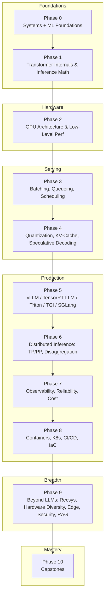
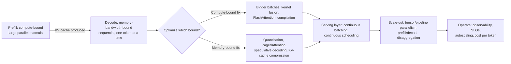

# Roadmap Diagram

```mermaid
flowchart TD
    subgraph Foundations
        P0[Phase 0\nSystems + ML Foundations]
        P1[Phase 1\nTransformer Internals & Inference Math]
    end
    subgraph Hardware
        P2[Phase 2\nGPU Architecture & Low-Level Perf]
    end
    subgraph Serving
        P3[Phase 3\nBatching, Queueing, Scheduling]
        P4[Phase 4\nQuantization, KV-Cache, Speculative Decoding]
    end
    subgraph Production
        P5[Phase 5\nvLLM / TensorRT-LLM / Triton / TGI / SGLang]
        P6[Phase 6\nDistributed Inference: TP/PP, Disaggregation]
        P7[Phase 7\nObservability, Reliability, Cost]
        P8[Phase 8\nContainers, K8s, CI/CD, IaC]
    end
    subgraph Breadth
        P9[Phase 9\nBeyond LLMs: Recsys, Hardware Diversity, Edge, Security, RAG]
    end
    subgraph Mastery
        P10[Phase 10\nCapstones]
    end

    P0 --> P1 --> P2 --> P3 --> P4 --> P5 --> P6 --> P7 --> P8 --> P9 --> P10

    click P0 "../ROADMAP.md#phase-0--systems--ml-foundations"
    click P10 "../ROADMAP.md#phase-10--capstones-this-is-where-top-1-gets-proven"
```

## Bottleneck map (what actually limits performance at each layer)

```mermaid
flowchart LR
    A[Prefill: compute-bound\nlarge parallel matmuls] -->|KV cache produced| B[Decode: memory-bandwidth-bound\nsequential, one token at a time]
    B --> C{Optimize which bound?}
    C -->|Compute-bound fix| D[Bigger batches, kernel fusion,\nFlashAttention, compilation]
    C -->|Memory-bound fix| E[Quantization, PagedAttention,\nspeculative decoding, KV-cache compression]
    D --> F[Serving layer: continuous batching,\ncontinuous scheduling]
    E --> F
    F --> G[Scale-out: tensor/pipeline parallelism,\nprefill/decode disaggregation]
    G --> H[Operate: observability, SLOs,\nautoscaling, cost per token]
```

See [`ROADMAP.md`](../ROADMAP.md) for the full explanation behind every node above.
